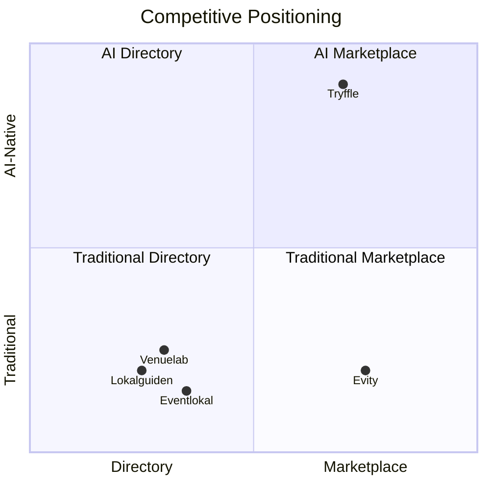
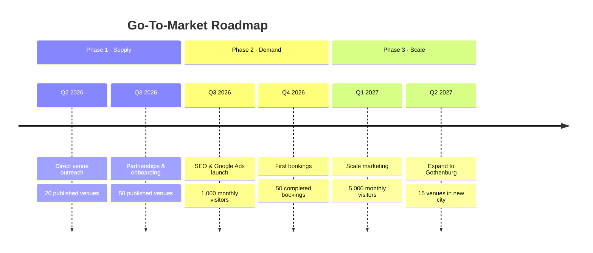
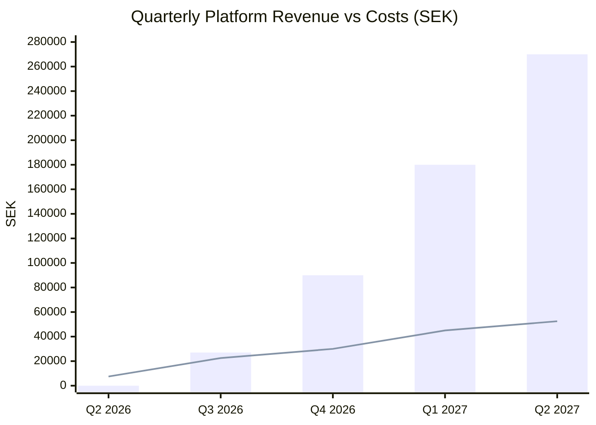
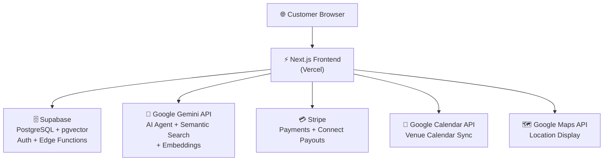
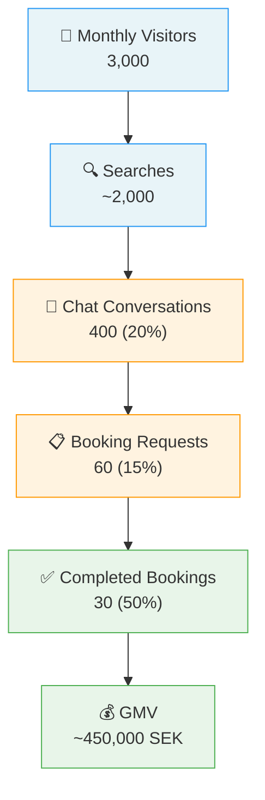

# Tryffle - Din personliga lokalagent

AI-powered marketplace for event venues in Stockholm.

hej@venueagent.se | venueagent.se

---

## Getting Started

```bash
npm run dev
```

Open [http://localhost:3000](http://localhost:3000) with your browser to see the result.

---

## Business Plan 2026

### Table of Contents

1. [Executive Summary](#executive-summary)
2. [Company Description](#company-description)
3. [Products & Services](#products--services)
4. [Market Analysis](#market-analysis)
5. [Marketing & Sales Strategy](#marketing--sales-strategy)
6. [Operational Plan](#operational-plan)
7. [Financial Plan](#financial-plan)
8. [Risk Analysis](#risk-analysis)
9. [Social Responsibility & Sustainability](#social-responsibility--sustainability)
10. [Exit Strategy](#exit-strategy)

---

### Executive Summary

Tryffle is an AI-powered marketplace for event venues in Stockholm. The platform connects people looking for event spaces with venue owners through natural language search and per-venue AI booking agents.

Unlike traditional venue directories that rely on filters and forms, Tryffle lets customers describe their event in plain language ("AW for 40 people on Sodermalm with a rooftop") and uses semantic AI matching to surface the best venues. Each listed venue has its own AI agent that answers questions, checks real-time availability, calculates pricing, and captures booking requests 24/7.

**Key figures:**
- Target market: Stockholm event venue market (~2,000+ venues)
- Revenue model: 12% platform fee on completed bookings
- Stage: Pre-revenue, product built, initial venues onboarded
- Team: Solo founder (technical)
- Monthly burn: ~3,000 SEK

**The opportunity:** The Swedish event venue market is fragmented. There is no dominant digital platform for venue discovery and booking in Stockholm. Venue owners handle inquiries manually via email and phone, losing leads outside business hours. Tryffle's AI agents solve this by providing instant, knowledgeable responses at any time.


---

### Company Description

#### Vision

To become Sweden's leading platform for event venue discovery and booking, powered by AI that makes finding and booking the perfect venue as easy as having a conversation.

#### Mission

To connect event organizers with the right venue through intelligent matching and AI-powered communication, saving time for both parties and eliminating the friction of traditional booking processes.

#### Goals

| # | Goal | Metric | Timeline |
|---|------|--------|----------|
| 1 | Reach 50 listed venues in Stockholm | Published listings | Q3 2026 |
| 2 | Process first 100 bookings through the platform | Completed bookings | Q4 2026 |
| 3 | Achieve 50,000 SEK monthly GMV | Gross Merchandise Value | Q1 2027 |
| 4 | Expand to Gothenburg and Malmo | Cities with 10+ listings each | Q2 2027 |

#### Company Structure

- **Legal entity:** Sole proprietorship (enskild firma), planned conversion to AB
- **Founded:** 2025
- **Location:** Stockholm, Sweden (remote-first, no office)
- **Team:** 1 person (founder - full-stack developer)

---

### Products & Services

#### For Event Seekers (Customers)

| Feature | Description |
|---------|-------------|
| **AI-Powered Search** | Describe your event in natural language. Tryffle's semantic search matches you with venues based on meaning, not just keywords. |
| **Per-Venue AI Agent** | Every venue has a 24/7 AI assistant that answers questions about capacity, pricing, availability, amenities, and house rules. |
| **Booking Requests** | Submit a booking request directly through chat. The venue owner responds within 24 hours. |
| **Transparent Rankings** | Venues are ranked by match quality, not by who pays the most. |
| **Free to Use** | Searching, chatting, and inquiring is completely free for customers. |

#### For Venue Owners

| Feature | Description |
|---------|-------------|
| **Free Listing** | Create a venue profile with photos, capacity, amenities, pricing, and vibes. No listing fee. |
| **AI Booking Agent** | A configurable AI agent that represents your venue, handles inquiries, checks your calendar, calculates pricing, and escalates when needed. |
| **Calendar Sync** | Two-way Google Calendar integration for real-time availability. |
| **Dashboard** | Manage bookings, view conversations, configure agent behavior, track payouts. |
| **Smart Notifications** | Email alerts for new bookings, messages, and agent escalations. |

#### Agent Configuration Options

Venue owners customize their AI agent's behavior:

- **Pricing rules:** Flat rate, per-person, minimum spend, packages
- **Booking parameters:** Min/max guests, duration limits, advance booking windows, blocked weekdays
- **Event type policies:** Per event type - welcome, declined, or escalate to owner
- **Custom FAQ:** Owner-defined Q&A the agent draws from
- **Policies:** Cancellation, deposit, and house rules
- **Language:** Swedish or English

#### Supported Event Types

| Category | Examples |
|----------|----------|
| AW / Afterwork | Friday drinks, team social |
| Conference | Full-day seminars, speaker events |
| Party / Celebration | Birthdays, graduations, release parties |
| Workshop | Team building, creative sessions |
| Dinner / Banquet | Sit-down meals, wine tastings |
| Corporate Event | Kickoffs, planning days, board meetings |
| Private Gathering | Family events, reunions |
| Wedding | Ceremonies, receptions |

#### Geographic Coverage

Stockholm, spanning 11 areas: Sodermalm, Vasastan, Ostermalm, Kungsholmen, Norrmalm, Gamla Stan, Djurgarden, Hammarby Sjostad, Hagersten, Solna, Sundbyberg.

---

### Market Analysis

#### Industry Overview

The Swedish event and conference market is valued at approximately 30 billion SEK annually. Stockholm, as the capital and largest city, represents the largest share of this market. The industry is characterized by:

- **Fragmentation:** Thousands of venues, from restaurants and hotels to dedicated event spaces, coworking hubs, and unique locations.
- **Manual processes:** Most venue booking still happens via email, phone, and web forms.
- **No dominant platform:** Unlike real estate (Hemnet) or accommodation (Airbnb), there is no single go-to platform for event venues in Sweden.
- **Growing demand for digital solutions:** Post-pandemic, event organizers increasingly expect digital-first booking experiences.

#### Target Market

**Primary segments:**

| Segment | Description | Estimated Size |
|---------|-------------|----------------|
| Corporate event planners | Companies booking AWs, conferences, kickoffs | ~50,000 companies in Stockholm |
| Private event organizers | Individuals booking parties, weddings, celebrations | ~200,000 events/year in Stockholm |
| Event agencies | Professional planners managing multiple events | ~500 agencies in the Stockholm region |

**Primary venue segments:**

| Segment | Description | Estimated Count |
|---------|-------------|-----------------|
| Restaurants with event space | Private dining rooms, full buyouts | ~800 in Stockholm |
| Dedicated event venues | Conference centers, party venues, galleries | ~400 in Stockholm |
| Hotels with event facilities | Meeting rooms, banquet halls | ~200 in Stockholm |
| Unique venues | Boats, rooftops, studios, warehouses | ~300 in Stockholm |

#### Customer Needs

| Need | Priority | How Tryffle Addresses It |
|------|----------|--------------------------|
| Find venues that match specific requirements | High | Semantic AI search understands nuanced requests |
| Get quick answers about a venue | High | Per-venue AI agent responds instantly, 24/7 |
| Compare options easily | Medium | Match-ranked results with key specs visible |
| Book without back-and-forth emails | Medium | In-chat booking flow with structured requests |
| Trust that pricing is transparent | Medium | Upfront pricing display, AI-calculated quotes |

#### Customer Avatar: "Anna" - Corporate Event Coordinator

| Attribute | Detail |
|-----------|--------|
| Age | 32 |
| Role | Office Manager at a 50-person tech company |
| Behavior | Plans 4-6 company events per year (AWs, kickoffs, summer party). Currently googles venues, emails 5-10, waits days for responses, compares in a spreadsheet. |
| Pain points | Time-consuming research, slow responses from venues, unclear pricing, hard to know if a venue truly fits without visiting. |
| What she wants | Describe the event once, get relevant options fast, ask questions and get answers immediately, book without friction. |

#### Customer Avatar: "Erik" - Venue Owner

| Attribute | Detail |
|-----------|--------|
| Age | 45 |
| Role | Owns a restaurant with a private event space on Sodermalm |
| Behavior | Gets 10-20 event inquiries per week via email and phone. Spends 1-2 hours daily responding to repetitive questions (capacity, price, availability). Loses leads that come in after hours. |
| Pain points | Repetitive inquiry handling, missed leads, no-shows from unqualified leads, manual calendar management. |
| What he wants | Something that handles the initial inquiry conversation, filters serious leads, and only involves him when a decision is needed. |

#### Competitive Landscape

**Direct Competitors (Sweden)**

| Competitor | Model | AI Features | Strengths | Weaknesses |
|------------|-------|-------------|-----------|------------|
| Lokalguiden.se | Directory / lead-gen | None | Established brand, SEO | Static listings, no booking, no AI |
| Venuelab.se | Directory | None | Curated Stockholm venues | Small inventory, manual process |
| Evity.se | Marketplace | None | Booking flow | No AI, filter-based search only |
| Eventlokal.se | Directory | None | Broad coverage | Outdated UX, no booking |

**Indirect Competitors**

| Competitor | Model | Relevance |
|------------|-------|-----------|
| Airbnb (Experiences) | Commission marketplace | Nearby space, proven marketplace model |
| Google Maps | Free discovery | Used for initial venue research |
| Word of mouth / Google Search | Free | Still the #1 way people find venues |

**Competitive Positioning**



Tryffle is the only player in the Swedish market combining marketplace functionality with AI-native search and per-venue conversational agents. No competitor offers real-time AI-powered Q&A or semantic search.

#### Market Trends

1. **AI adoption accelerating:** 36% of couples used AI in wedding planning in 2025, nearly double from 2024 (WeddingPro data). Similar trends expected across all event types.
2. **Platform consolidation:** Fragmented markets tend to consolidate around 1-2 dominant platforms.
3. **Conversational commerce:** Users increasingly expect to chat rather than fill forms.
4. **SMB automation:** Small venue owners are adopting tools that reduce manual work.

---

### Marketing & Sales Strategy

#### Go-To-Market Strategy



**Phase 1: Supply-first (Q2-Q3 2026)**
Build venue inventory through direct outreach.

| Channel | Approach | Target |
|---------|----------|--------|
| Direct sales (email/phone) | Personal outreach to Stockholm venues | 50 venues |
| Partnerships | Event industry associations, coworking networks | 3-5 partners |
| Free onboarding | White-glove setup of venue profiles and AI agents | All early venues |

**Phase 2: Demand generation (Q3-Q4 2026)**
Drive customer traffic once inventory is sufficient.

| Channel | Approach | Budget |
|---------|----------|--------|
| SEO / Content | "Best venues for [event type] in Stockholm" content | 0 SEK (organic) |
| Google Ads | Targeted keywords: "eventlokal stockholm", "konferenslokal" | 5,000-10,000 SEK/month |
| Social media | Instagram/LinkedIn showcasing featured venues | 0-2,000 SEK/month |
| PR | Tech/startup press about AI-powered venue booking | 0 SEK |

**Phase 3: Network effects (2027)**
As inventory and demand grow, focus shifts to retention and expansion.

| Channel | Approach |
|---------|----------|
| Referrals | Venues recommend Tryffle to event organizers |
| Repeat bookings | Customers return for future events |
| Geographic expansion | Launch Gothenburg and Malmo |

#### Sales Process (Venue Owners)


1. **Identify** - Find venues via Google Maps, Instagram, event directories
2. **Outreach** - Personalized email/call explaining the value proposition
3. **Demo** - Show the AI agent in action on a similar venue
4. **Onboard** - Free setup: create listing, configure AI agent, connect calendar
5. **Activate** - First booking request within 30 days

#### Pricing Strategy

| What | Who Pays | Amount |
|------|----------|--------|
| Venue listing | Venue owner | Free |
| AI agent | Venue owner | Free (included) |
| Platform fee | Customer (added to booking) | 12% of base price |
| Payment processing | Deducted from transaction | ~1.4% + 1.80 SEK (Stripe) |

The 12% fee is competitive with international benchmarks (Peerspace charges ~15%). Listing is free to minimize friction for venue onboarding.

---

### Operational Plan

#### Technology Stack

| Layer | Technology | Cost |
|-------|-----------|------|
| Frontend & Backend | Next.js 16 (App Router, TypeScript) | - |
| Hosting | Vercel | ~200 SEK/month |
| Database & Auth | Supabase (PostgreSQL + pgvector) | ~250 SEK/month |
| AI / LLM | Google Gemini 1.5 Flash | ~500-2,000 SEK/month (usage-based) |
| Payments | Stripe + Stripe Connect | Transaction fees only |
| Maps | Google Maps API | ~200 SEK/month |
| Email | Supabase Edge Functions | Included |
| Domain & Email | venueagent.se | ~150 SEK/month |
| **Total** | | **~1,300-2,800 SEK/month** |

#### Key Processes

| Process | How | Frequency |
|---------|-----|-----------|
| Venue onboarding | Founder handles directly: profile creation, AI agent setup, calendar connection | Per new venue |
| Customer support | In-app chat, email | As needed |
| AI agent monitoring | Review escalated conversations, tune prompts | Weekly |
| Platform maintenance | Bug fixes, feature development | Continuous |
| Financial operations | Stripe handles payments and payouts automatically | Automated |

#### Activity Plan (Q2 2026 - Q2 2027)

| Quarter | Activity | Goal | KPI |
|---------|----------|------|-----|
| Q2 2026 | Direct venue outreach in Stockholm | Build initial supply | 20 published venues |
| Q2 2026 | SEO content creation | Build organic search foundation | 10 pages indexed |
| Q3 2026 | Launch Google Ads campaign | Drive first customer traffic | 1,000 monthly visitors |
| Q3 2026 | Continue venue outreach | Grow inventory | 50 published venues |
| Q4 2026 | First bookings through platform | Validate revenue model | 50 completed bookings |
| Q4 2026 | Iterate on AI agent based on conversation data | Improve conversion | 30% inquiry-to-booking rate |
| Q1 2027 | Scale marketing spend | Grow demand | 5,000 monthly visitors |
| Q1 2027 | Introduce venue analytics dashboard | Increase venue retention | 90% venue retention |
| Q2 2027 | Expand to Gothenburg | Geographic expansion | 15 venues in Gothenburg |

---

### Financial Plan

#### Assumptions

- Average booking value: 15,000 SEK (mix of AWs at ~5,000 SEK and larger events at ~30,000+ SEK)
- Platform fee: 12% of base price = ~1,800 SEK average revenue per booking
- Bookings grow from 0 to ~50/month over 12 months
- Monthly fixed costs: ~2,500 SEK (infrastructure)
- Marketing spend starts Q3 2026 at 5,000 SEK/month, scaling to 15,000 SEK/month
- No salary drawn in year 1
- No external funding

#### Revenue Projections



| Quarter | Bookings | GMV (SEK) | Platform Revenue (SEK) | Monthly Costs (SEK) | Net (SEK) |
|---------|----------|-----------|------------------------|---------------------|-----------|
| Q2 2026 | 0 | 0 | 0 | 7,500 | -7,500 |
| Q3 2026 | 15 | 225,000 | 27,000 | 22,500 | +4,500 |
| Q4 2026 | 50 | 750,000 | 90,000 | 30,000 | +60,000 |
| Q1 2027 | 100 | 1,500,000 | 180,000 | 45,000 | +135,000 |
| Q2 2027 | 150 | 2,250,000 | 270,000 | 52,500 | +217,500 |
| **Year 1 Total** | **315** | **4,725,000** | **567,000** | **157,500** | **+409,500** |

#### Break-Even Analysis

At 2,500 SEK/month fixed costs (pre-marketing):
- Break-even = 2 bookings/month (2 x 1,800 SEK = 3,600 SEK)

At 15,000 SEK/month total costs (with marketing):
- Break-even = 9 bookings/month (9 x 1,800 SEK = 16,200 SEK)

#### Funding

No external funding is currently sought. The low cost structure (no office, no employees, usage-based AI costs) means the business can reach profitability with modest booking volume. If growth accelerates, a seed round of 1-3 MSEK could fund:
- Hiring 1-2 people (sales, customer success)
- Increased marketing spend
- Faster geographic expansion

---

### Risk Analysis

| Risk | Severity | Likelihood | Impact | Mitigation |
|------|----------|------------|--------|------------|
| **Disintermediation** - Customers and venues bypass the platform after discovery to avoid the 12% fee | High | High | High | Provide value beyond discovery: AI agent, calendar sync, payment handling, booking management. Consider switching to SaaS pricing model if disintermediation persists. |
| **Low venue adoption** - Venue owners don't see value or won't invest time in onboarding | High | Medium | High | White-glove onboarding (founder sets up everything). Demonstrate ROI with lead tracking. Make listing free with zero commitment. |
| **Low customer demand** - Not enough event organizers find or use the platform | High | Medium | High | Invest in SEO and targeted Google Ads. Build content around high-intent searches. Partner with event-adjacent businesses. |
| **AI quality issues** - AI agent gives incorrect information, hallucinates, or frustrates customers | Medium | Medium | Medium | All AI responses are grounded in venue-owner-provided data. Regular review of escalated conversations. Clear disclaimers. Human escalation path always available. |
| **Competitor response** - Established players add AI features or a well-funded competitor enters | Medium | Medium | Medium | Move fast to build supply-side network effects. First-mover advantage in Swedish market. Deep venue owner relationships as moat. |
| **Regulatory risk** - Changes to AI regulations, payment regulations, or consumer protection laws | Low | Low | Medium | Monitor EU AI Act developments. Ensure compliance with GDPR (data stored in EU). Stripe handles PSD2/SCA compliance. |
| **Key person risk** - Solo founder, single point of failure | High | Medium | High | Document all processes. Use managed services (Supabase, Vercel, Stripe) to minimize operational burden. Plan to hire once revenue supports it. |
| **Seasonal demand** - Event bookings are cyclical (peaks in spring/fall, dips in summer/January) | Medium | High | Low | Diversify event types. Corporate events peak differently than private events. Build recurring venue relationships that smooth revenue. |

---

### Social Responsibility & Sustainability

#### Environmental

- **Fully digital product** - No physical operations, minimal carbon footprint
- **Remote-first** - No office commuting
- **Cloud infrastructure** - Hosted on providers (Vercel, Supabase) committed to renewable energy
- **Reduced waste** - By matching customers with the right venue faster, fewer "wrong fit" bookings that lead to wasted resources

#### Social

- **Transparent rankings** - Venues are ranked by match quality, not ad spend, giving smaller venues fair visibility
- **Accessibility** - Platform built with web accessibility standards
- **Supporting small businesses** - Many venue owners are small business operators who benefit from AI-powered tools they couldn't afford to build themselves

#### Ethical AI

- AI agents are clearly identified as AI, not pretending to be human
- All AI responses are grounded in venue-owner-provided data to minimize hallucination
- Human escalation path is always available
- No customer data is used to train external AI models

---

### Exit Strategy

#### Scenario 1: Acquisition by Event/Hospitality Platform

The most likely exit path. Potential acquirers include:

- **Tripleseat / EventUp** - US-based venue management SaaS looking for European expansion and AI capabilities
- **The Knot Worldwide (WeddingPro)** - Actively investing in AI, could acquire for Swedish market entry
- **Hemnet / Booli** - If pivoting into adjacent verticals (events, experiences)
- **Nordic hospitality tech companies** - Convene, Deskbird, or similar

**Value proposition to acquirer:** Proven AI agent technology, venue network in Stockholm, Swedish market knowledge.

#### Scenario 2: SaaS Pivot and Independent Growth

If the marketplace model proves challenging, the AI agent technology can be extracted and sold as B2B SaaS to venue owners directly. This creates a more predictable revenue stream and a potentially independent growth path.

#### Scenario 3: Geographic Licensing

License the platform (technology + playbook) to operators in other Nordic markets (Norway, Denmark, Finland) or other European markets.

---

### Appendix

#### A. Technology Architecture



#### B. Conversion Funnel



#### C. Key Metrics to Track

| Metric | Definition | Target (Month 6) |
|--------|-----------|-------------------|
| Listed venues | Published venue profiles | 50 |
| Monthly visitors | Unique visitors to platform | 3,000 |
| Search-to-chat rate | % of searches that lead to a chat conversation | 20% |
| Chat-to-booking rate | % of chat conversations that result in a booking request | 15% |
| Booking completion rate | % of booking requests that become completed bookings | 50% |
| GMV | Total value of bookings processed | 250,000 SEK/month |
| Platform revenue | 12% of GMV | 30,000 SEK/month |
| Venue retention | % of venues still active after 3 months | 80% |
| NPS (customers) | Net Promoter Score | 50+ |
| NPS (venue owners) | Net Promoter Score | 40+ |
